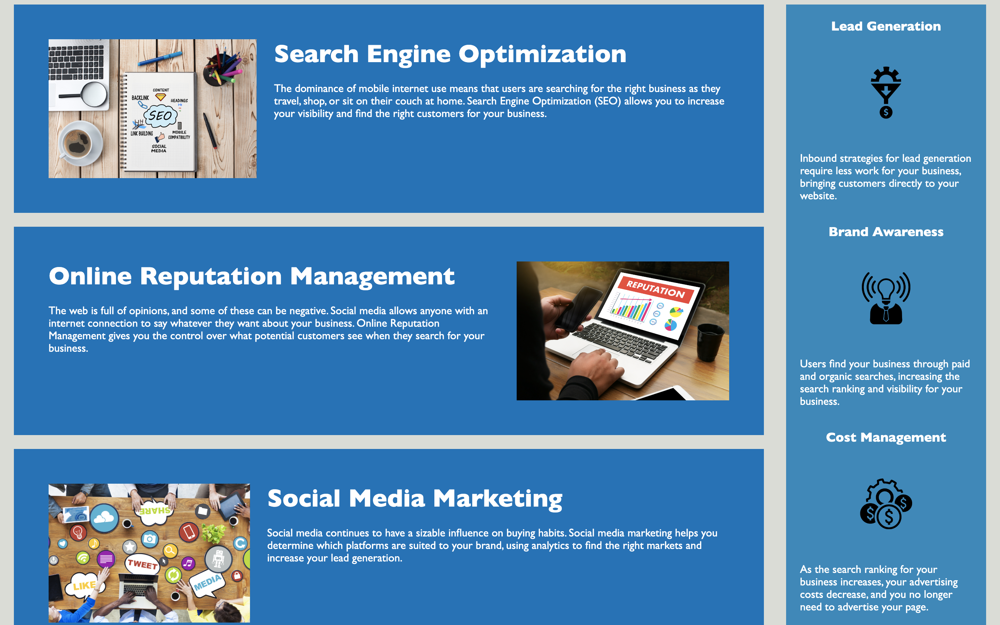

# 01 Challenge Code Refractor

## Description

A marketing agency wanted a webpage that followed accessibility standards and one that is optimized for search engines. I was given a code base to work off of, in which I made improvements to the code itself, reducing redundancy and making the code more tidy. I helped the marketing agency ensure that there webpage can be accessed by everyone and that they would get more hits on search engines. Overall, I learned more about styling multiple html elements/classes at once. 

## Table of Contents

N/A

## Installation

Fork my repo on GitHub and open in your favorite code editor.

## Usage

https://eziegler11.github.io/01-challenge-code-refractor/

## Credits

DU Coding Bootcamp 2022

## License

MIT License

Copyright (c) 2022 Erich Z.

Permission is hereby granted, free of charge, to any person obtaining a copy
of this software and associated documentation files (the "Software"), to deal
in the Software without restriction, including without limitation the rights
to use, copy, modify, merge, publish, distribute, sublicense, and/or sell
copies of the Software, and to permit persons to whom the Software is
furnished to do so, subject to the following conditions:

The above copyright notice and this permission notice shall be included in all
copies or substantial portions of the Software.

THE SOFTWARE IS PROVIDED "AS IS", WITHOUT WARRANTY OF ANY KIND, EXPRESS OR
IMPLIED, INCLUDING BUT NOT LIMITED TO THE WARRANTIES OF MERCHANTABILITY,
FITNESS FOR A PARTICULAR PURPOSE AND NONINFRINGEMENT. IN NO EVENT SHALL THE
AUTHORS OR COPYRIGHT HOLDERS BE LIABLE FOR ANY CLAIM, DAMAGES OR OTHER
LIABILITY, WHETHER IN AN ACTION OF CONTRACT, TORT OR OTHERWISE, ARISING FROM,
OUT OF OR IN CONNECTION WITH THE SOFTWARE OR THE USE OR OTHER DEALINGS IN THE
SOFTWARE.
